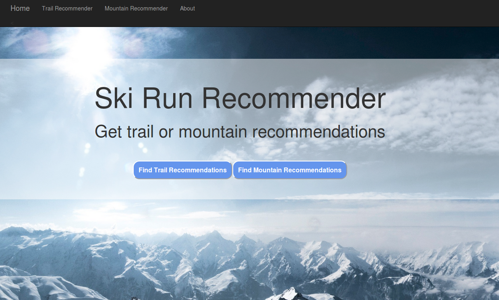
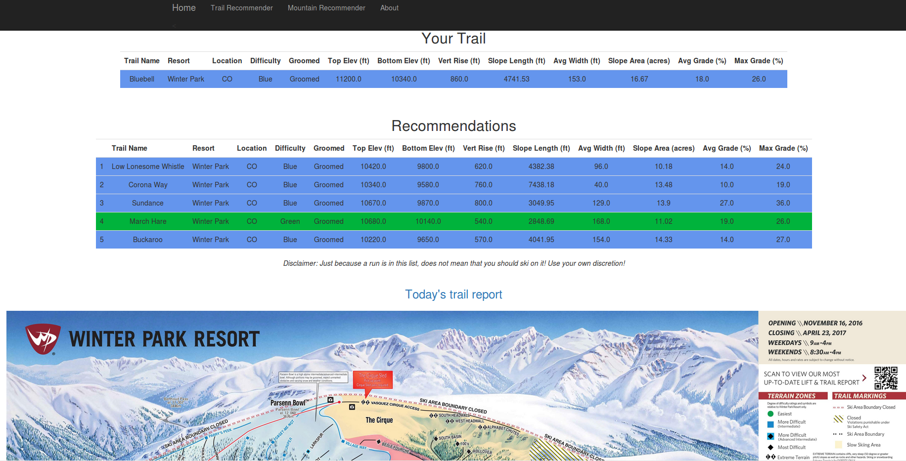
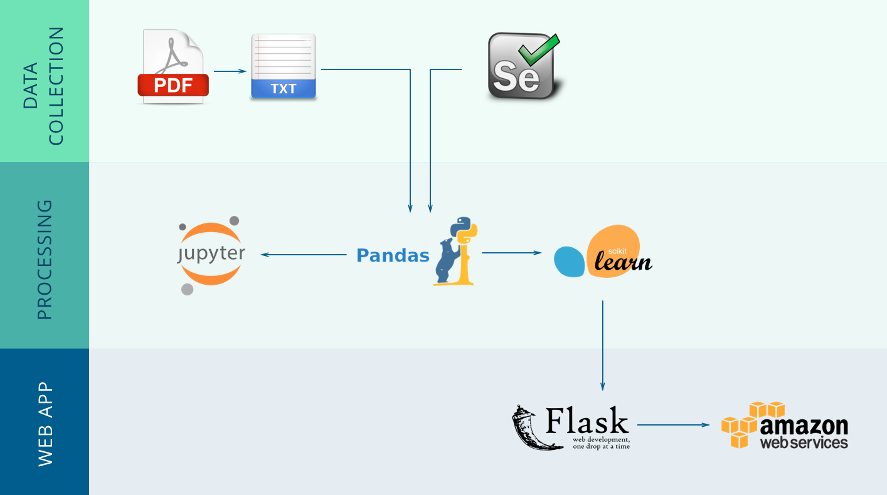

# Ski Run Recommender

Karen Farbman

Galvanize Data Science Immersive - October 2017

[SkiRunRecommender.com](http://www.skirunrecommender.com)

## Table of Contents
1. [Background](#background)
2. [Web Application](#web-application)
3. [Data Collection and Cleaning](#data-collection-and-cleaning)
4. [Technologies Used](#technologies-used)
5. [Recommender System](#recommender-system)
6. [Future Steps](#future-steps)
7. [Repo Structure](#repo-structure)

## Background

As I was prepping for my Professional Ski Instructors of America (PSIA) Level 3 exam at Vail (never having skied at Vail), word on the slopes was that the mogul portion of the ski exam was going to be on Prima and Pronto. From my research on Vail, I knew that Prima and Pronto were black and double black, but I didn't know what to compare them to. With Winter Park as my home mountain, I had skied a huge range of black mogul runs, and they were all vastly different. Someone told me that if I could ski Outhouse at Winter Park, that was a pretty good indicator of how I would do on Prima or Pronto - they had a similar slope and width and were ungroomed. 

How awesome would it be to find runs similar to a given run based on their features, even at a mountain you know nothing about? You can find runs at a mountain you're unfamiliar with that are similar to a run you love. Or you can find out what a run you've never skied on is like by comparing similar runs at a resort you know.

## Development

### Build Docker Image

```bash
docker build -t skirec:dev .
```

### Mount Image to Repo

```bash
docker run --rm -ti \
    --name ski-recsys \
    -v "$PWD":/recsys skirec:dev \
    ipython
```

### Run Web App

```bash
docker run --rm -ti \
    --name ski-recsys \
    -p 8080:8080 \
    -v "$PWD":/recsys skirec:dev \
    python web_app/app.py
```

## Testing

```bash
docker run --rm -ti \
    --name ski-recsys \
    -v "$PWD":/recsys skirec:dev \
    pytest --cov=src tests/
```

## Web Application 

[SkiRunRecommender.com](http://www.skirunrecommender.com)



From the homepage, you can choose if you want a specific trail recommendation, or if you want a recommendation on which mountain to ski.

Then, you can select a trail that you like from a resort that you know. You have the option to select which resort you would like recommendations at (for the trail recommender), which difficulty trails you would like included (also for the trail recommender) and how many recommendations you would like.


This will bring up a page with the original trail, as well as the recommendations and their stats, trail maps, and links to the resorts' trail report for that day.

### Trail Recommendations


### Mountain Recommendations


## Data Collection and Cleaning

All trail and mountain data is downloaded from [JollyTurns](https://jollyturns.com/resorts/country/united-states-of-america). Once downloaded, all data is formatted in a Pandas DataFrame. Because all data is requested from a one website, the preprocessing pipeline is identical for trail and mountain data. 

Archived grooming reports were utilized to identify runs which are groomed each day. Additionally, the resort ticket price was fetched manually from each resort of interest.

The dataset consists of 2,125 runs from 18 different resorts. The features used for trail and mountain recommendations include:
* Resort
* Location
* Difficulty
* Groomed
* Top Elevation (ft)
* Bottom Elevation (ft)
* Slope Length (ft)
* Percent Greens
* Percent Blues
* Percent Blacks
* Percent Double Blacks
* Terrain Parks
* Lifts
* Price

## Technologies Used

|Software|
|:----:|
|AWS|
|BeautifulSoup|
|Flask|
|HTML/ JavaScript/ CSS|
|Matplotlib|
|Numpy|
|Pandas|
|Scikit Learn|
|Selenium|



## Recommender System

This recommender takes into account information about the runs. It looks at a run and calculates how similar it is to every other run. The runs are sorted from most similar to least similar and then filtered by resort or difficulty level if desired. By starting with a run you know you like, the recommendation system returns the runs that are most similar to your initial interest.

The similarity metric used is the cosine similarity. For the trail recommendations, the similarity is calculated between the chosen run and all other runs. For the mountain recommendations, the average of the similarities between the chosen run and all of the runs at each mountain is calculated, and the resorts are sorted by highest average similarity.

## Future Steps

* Including more trails from more resorts.
* Automate requesting groomed runs per resort.

## Repo Structure

```
├── data (contains CSV and Parquet files of trail and mountain data)
|     ├── combined_data_20200423.csv (CSV of combined trail and mountain data)
|     ├── mountain_data_20200423.parquet (Parquet file of mountain data)
|     └── trail_data_20200423.parquet (Parquet file of trail data)
├── notebooks (contains scripts used for testing and visualizations)
|     └── visualizations.ipynb (interesting visualizations)
├── src
|     ├── comb_tables.py
|     |       -Merge trail and mountain data (created from webscrape_trails and make_mtn_df scripts)
|     |       -Adds grooming column
|     |       -Maps location based on resort
|     |       -saves a CSV of the DataFrame
|     ├── make_mtn_df.py (creates DataFrame of webscraped mountain data)
|     └── webscrape_trails.py (webscrapes to get trails by color for each resort, saves a pickle of dictionary of results)
├── web_app
|     ├── static
|     ├── templates
|     ├── app.py (runs web app)
|     └── app.py (runs recommendation system)
└── README.md
```

## References

* [AWS - CodeBuild Sample](https://docs.aws.amazon.com/codebuild/latest/userguide/sample-ecr.html)
